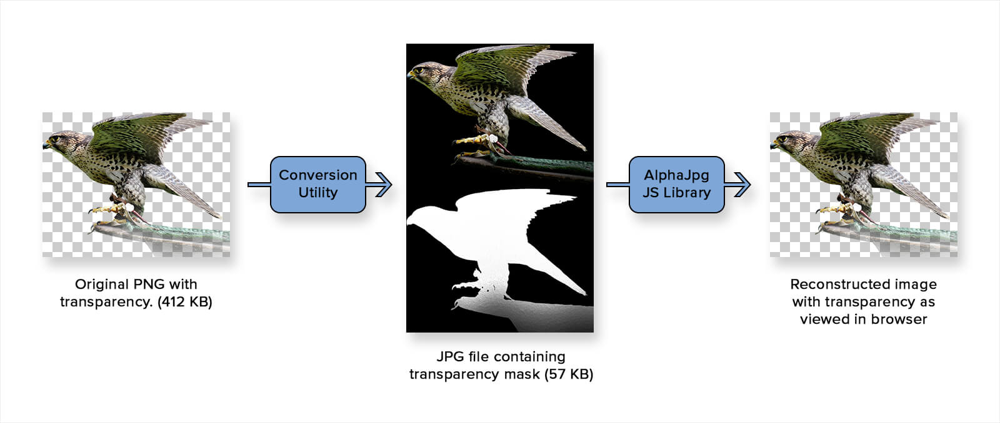

# AlphaJpg

AlphaJpg is a technique for loading photographic images with alpha transparency in web browsers. Image file sizes are generally much smaller than PNG24, are comparable to WebP, and work on a wide assortment of browsers.


## The Problem

Sometimes a website design requires a complex image (like a photograph) as well as transparency. The JPG image format is lossy and compresses photographic images well, however it does not support alpha transparency. The WebP image format compresses photographic images well and supports alpha transparency, but its browser support is lacking. While [support for WebP](https://caniuse.com/#feat=webp) is growing, at the time of writing, it is not supported in IE, Safari, or iOS Safari. Developers tend to resort to the PNG24 image format, which supports transparency, but is lossless and creates larger image file sizes. AlphaJpg seeks to provide an alternative tool to a developers toolbox, which allows the delivery of a smaller image file across a broad range of browsers.


## Overview

The general workflow of using AlphaJpg is summarized below.




## Step 1: Conversion

The source PNG file must first be converted into a [specially crafted JPG](http://dev.aaron.juiceinteractive.com/alphajpg/demos/img/test0.alpha.jpg) file. This JPG file replaces any transparency with a black background and adds a black and white image mask to the bottom of the image. Although creating this JPG file is possible in most image editing software like Photoshop, it is a tedious task. 

### Online Conversion
An [online converter](https://porcupine021.github.io/alphajpg/utils/alphaJpg.html) makes conversion as easy as dragging and dropping your source PNG file.  This conversion utility uses HTML `<canvas>` to generate the final image. Save the image as a PNG file and then convert it to JPG using your image editor of choice.

### Command Line Utility
For users who wish to automate this conversion process, a [command line utility](https://github.com/Porcupine021/alphajpg/blob/master/utils/alphaJpg.php) is also provided. This command line utility requires:

+ [PHP](http://php.net/)

and one of the following PHP image manipulation extensions:

+ [IMagick](http://php.net/manual/en/book.imagick.php) (recommended)  
+ [GD](http://php.net/manual/en/book.image.php)

#### Example Usage

Show detailed help.

`#> php alphaJpg.php`

Create a JPG file out/myImage.alpha.jpg with default quality (75%).

`#> php alphaJpg.php somePath/myImage.png out/`

Create a PNG file myImage.alpha.png in the current directory.

`#> php alphaJpg.php -p somePath/myImage.png .`

Create a JPG file myImage.alpha.jpg in the current directory with JPG compression quality 80%.

`#> php alphaJpg.php -quality=80 somePath/myImage.png .`

### JPG Compression
To get the most filesize savings out of AlphaJpg, try to deliver the smallest JPG file possible. Options include:

+ Use a tool specifically designed for JPG compression like:
  + [JPEGMini](https://www.jpegmini.com/)
  + [TinyJpg](https://tinyjpg.com/)
+ Hand optimize the JPEG quality in your image editor of choice


## Step 2: Reconstruction

The next step is to provide a way to reconstruct the original image with transparency from the specially crafted JPG file.  AlphaJpg provides three different Javascript libraries to choose from:

  + [AlphaJpg_Canvas](https://github.com/Porcupine021/alphajpg/blob/master/js/AlphaJpg-Canvas.js) (recommended)
  + [AlphaJpg_WebGL](https://github.com/Porcupine021/alphajpg/blob/master/js/AlphaJpg-WebGL.js)
  + [AlphaJpg_SVG](https://github.com/Porcupine021/alphajpg/blob/master/js/AlphaJpg-SVG.js) (experimental)

In almost all cases the canvas implementation should be used. It supports the widest range of browsers and is generally the fastest at reconstructing the original image.

All AlphaJpg libraries implement the same interface. The following examples will use the canvas implementation, but the methods shown are available in all implementations.

### Basic Setup

Include the AlphaJpg javascript file into your project.

```html
<script src="AlphaJpg-Canvas.js"></script>
```

Use the `load` method to fetch and reconstruct the image.

```javascript
var imgUrl = 'http://example.com/myImage.alpha.jpg';

AlphaJpg_Canvas.load(imgUrl, function(canvas){
  // do something with canvas, which contains reconstructed image
  document.body.appendChild(canvas);
});
```

The `load` method accepts the following arguments:

`AlphaJpg_Canvas.load(imgUrl, callback, returnDataUrl);`

  + **`imgUrl`** (*String*) The relative or absolute URL to your specially crafted JPG file.
  + **`callback`** (*Function*) A callback function which is executed once the image has been reconstructed. The callback function accepts one argument. The value of this argument can be:
    + A `<canvas>` DOM Element if the image was successfully reconstructed.
    + A boolean `false` if the library failed to load the image or the browser does not have the required features necessary for reconstruction.
    + A `String` containing the reconstructed image as a Base64 encoded Data URI.
  + **`returnDataUrl`** (*Boolean*) (*Optional*) A flag that instructs the library whether it should return a `<canvas>` element or a Base64 encoded Data URI. Default is `false`.


Use the `isSupported` method to explicitly test whether the browser is capable of reconstructing the image.

```javascript
if(AlphaJpg_Canvas.isSupported()){
  console.log('Success! We have support.');
}
```

The `isSupported` method accepts the following arguments:

  + **`returnDataUrl`** (*Boolean*) (*Optional*) A flag that indicates whether support for Base64 encoded Data URI's should be tested. Default is `false`.


## Demos

See AlphaJpg in action on the [demos page](https://porcupine021.github.io/alphajpg/demos/index.html).


## Caveats & Known Issues

  + The AlphaJpg technique trades smaller image file sizes for an increase in CPU power needed to reconstruct the image.  If your website or web application parses and executes a lot of javascript, it would be best to delay the AlphaJpg reconstruction of images until after the site has finished loading.

  + Images loaded from external domains (like a CDN) may be reconstructed. However, the CDN or external site must deliver proper CORS headers that inform the browser that it is allowed to access and manipulate the image's pixel data. MDN has [more info](https://developer.mozilla.org/en-US/docs/Web/HTML/CORS_enabled_image) about the use of CORS and cross origin images. Internet Explorer 9 does not support CORS images.

  + A `<canvas>` or `<svg>` doesn't always behave in the same way as a responsive ``. To ensure the most consistent responsive behavior across browsers, one may use an [aspect ratio preserving](https://css-tricks.com/aspect-ratio-boxes/) technique.  All [demos](https://porcupine021.github.io/alphajpg/demos/index.html) use this technique.